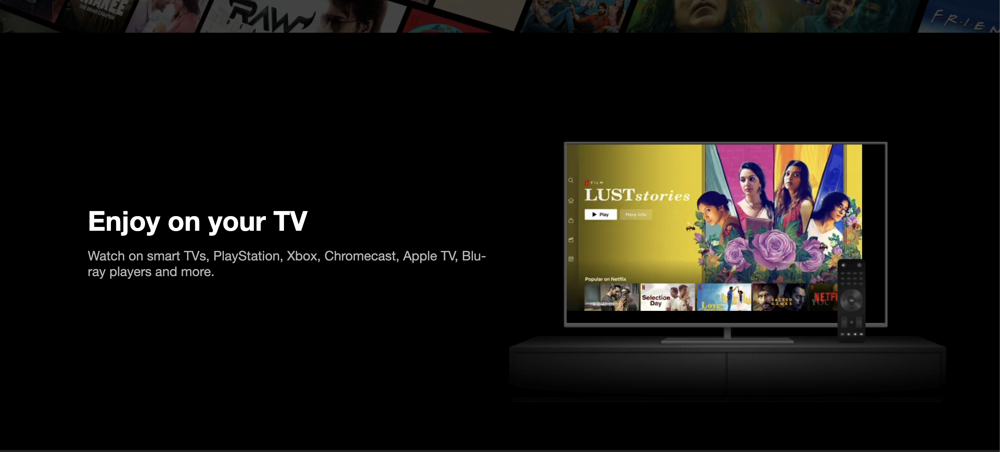
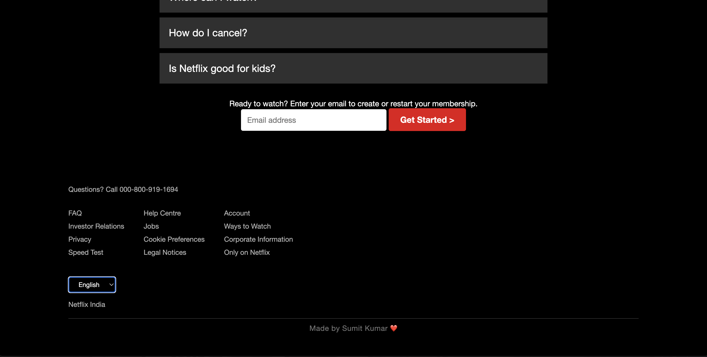

````markdown
 # 📺 Netflix India Clone

A visually stunning and responsive **Netflix India landing page clone**, built purely using **HTML and CSS**.  
This project recreates the official Netflix homepage experience — including sections like the hero banner, features, FAQ, and footer — with a clean, cinematic design.

---

## 🧰 Tech Stack

- **HTML5**
- **CSS3 (Flexbox + Responsive Design)**
- **No JavaScript / frameworks used**

---

## 🎯 Features

- ✅ Netflix-inspired modern UI  
- ✅ Responsive layout for all devices  
- ✅ Background hero section with overlay  
- ✅ Realistic feature showcase sections with video and images  
- ✅ Interactive buttons and hover transitions  
- ✅ FAQ-style layout  
- ✅ Footer with links and credit  
- ✅ **Made by Sumit Kumar ❤️**

---

## 🖼️ Preview

> If the previews don’t load on GitHub, open the `assets/images/` folder in your repo to view them manually.

<p align="center">
  
</p>
<p align="center">
  
</p>
<p align="center">
  
</p>

---

## 🗂️ Folder Structure

```bash
Netflix-Clone/
│
├── assets/
│   └── images/
│       ├── bg.jpg
│       ├── logo.svg
│       ├── prev1.png
│       ├── prev2.png
│       └── prev3.png
│
├── index.html
├── style.css
└── README.md
````

---

## ⚙️ How to Run Locally

1. **Clone the repository:**

   ```bash
   git clone https://github.com/sumitkr-2/Netflix-Clone.git
   ```

2. **Navigate into the project folder:**

   ```bash
   cd Netflix-Clone
   ```

3. **Open the project:**
   Simply open `index.html` in your browser.
   That’s it — no additional setup required.

---

## 🌐 Deployment

You can deploy this project easily using any static hosting service like:

* **GitHub Pages**
* **Netlify**
* **Vercel**

**Example (GitHub Pages):**

1. Push your code to GitHub.
2. Go to **Settings → Pages**.
3. Under **Branch**, select `main` → `/ (root)` → Save.
4. Your site will be live in seconds.

---

## 👨‍💻 Author

**Made by [Sumit Kumar](https://www.linkedin.com/in/sumit-kumar2004/) ❤️**
Front-End Developer | Web Enthusiast

💼 Connect with me on [LinkedIn](https://www.linkedin.com/in/sumit-kumar2004/)

---

## 🧾 License

This project is intended **for educational purposes only**.
All assets, logos, and trademarks belong to **Netflix, Inc.**
Used here **only for learning and portfolio demonstration**.
